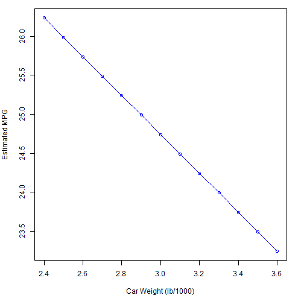

## Introduction

Fuel efficiency is an important factor to look at when determining which car type/model to go for. A car with high fuel efficiency will save the driver money in the long run, and vice versa for a car with low fuel efficiency.

This is a simple shiny app that predicts the MPG (Miles Per Gallon) of a car with specific number of Cylinders, its Horsepower, and transmission type (Auto/Manual) over a range of car weights (lb/1000).

The dataset used to create the Linear Model for the above prediction is the mtcars dataset provided by R Studio.

mtcars itself is extracted from the 1974 Motor Trend US magazine, and comprises fuel consumption and 10 aspects of automobile design and performance for 32 automobiles (1973-74 models).

--- .class #id 

## How the App Work


The linear model is first built using the lm() function, and then the step() function is used to further improve the model.

The input values are then provided by the user, which will then be converted into a data.frame before the model can be used.

Once the model has predicted the MPG for all inputs provided, a Line Chart is displayed for the user for easy analysis.

--- .class #id 

## Example

```r
#The chart obtained when setting the weight range from 2.4 to 3.7 (lb/1000), Number of Cylinders =6, Manual Transmission Type and 8 Horsepower.
buildPlot(6,8,2.4,3.7,0.1,"Manual")
```

 

--- .class #id 

## End Word and Thank You
Thank you for taking the time to read through this and I hope this simple MPG Calculator will assist you in your next car purchase!!
